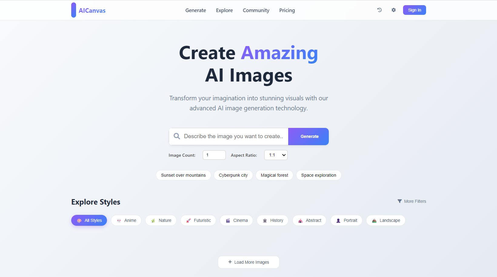

# AICanvas - AI Image Generation Web App

 <!-- Optional: add your screenshot here -->

## Overview
AICanvas is a web-based AI image generation platform that allows users to create stunning visuals from text prompts. It leverages Hugging Face's Stable Diffusion models to generate high-quality images. Users can customize **image count** and **aspect ratio**, and view generated images in a responsive gallery.

---

## 🏗️ Project Architecture

Frontend (HTML / CSS / JavaScript)
↓
Backend API (Node.js + Express)
↓
AI Provider (Hugging Face / Replicate / Others)

---
## Features
- Generate AI images from text prompts.
- Support for multiple image generation at once.
- Adjustable aspect ratios: 1:1, 4:3, 3:2, 16:9.
- Quick prompt buttons for fast image creation.
- Responsive gallery to view generated images.
- Future-proof design: works with Hugging Face API updates.

---

## Setup & Usage

1. **Clone the repository**
```bash
git clone https://github.com/alwar123/AICanvas.git
cd AICanvas

Install Dependencies
npm install

3️⃣ Environment Variables

Create a .env file in the project root and add your API key:

HF_TOKEN=your_api_key_here


⚠️ The .env file is ignored by Git using .gitignore
Never commit API keys to GitHub.

4️⃣ Start the Server
npm start


The application will run at:

http://localhost:3000

5️⃣ Use the Application

Open the browser

Navigate to http://localhost:3000

Enter a text prompt

Select image count and aspect ratio

Click Generate

View generated images in the gallery